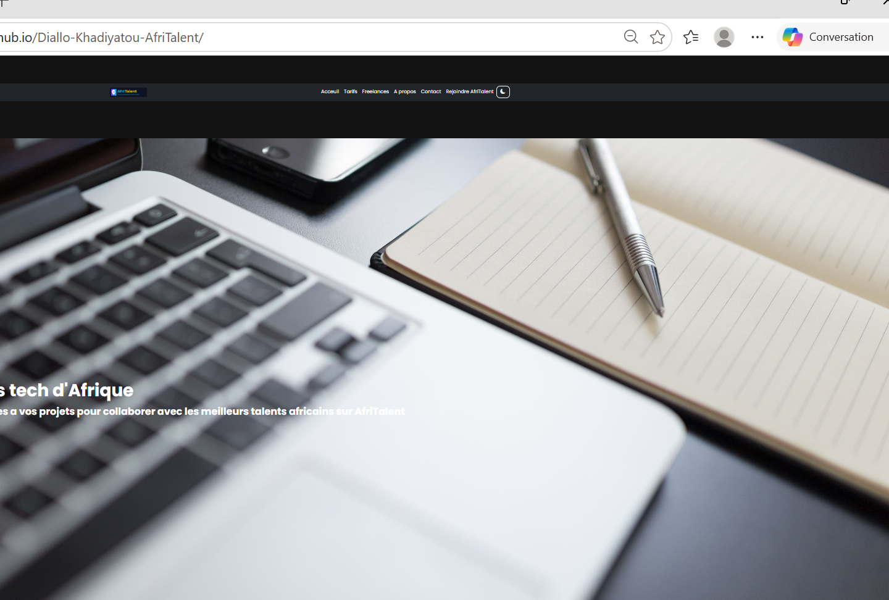

#AfriTalent
projet fil rouge -plateforme de mise en relation entre freelances africains et clients.
Auteur : Khadiyatou Diallo
promotion :L1 IAGE -ISI
## Lien du site : [AfriTalent]( https://khadiyatoud785-bit.github.io/Diallo-Khadiyatou-AfriTalent/)

## Description

AfriTalent est une plateforme web permettant de mettre en relation des freelances africains et des clients à la recherche de compétences dans différents domaines :

- Développement Web
- Design Graphique
- Marketing Digital
- Rédaction de contenu
- Data & IA
## Fonctionnalités
- Page d'accueil moderne
- Présentation des catégories de services
- Liste des freelances
- Filtrage dynamique par catégorie
- Mode sombre / clair
- Formulaire de contact avec validation JavaScript
- Site responsive avec Bootstrap 5
## Technologies utilisées

- HTML5
- CSS
- Bootstrap 5
- JavaScript
- Git & GitHub
- GitHub Pages

## Capture d'écran
